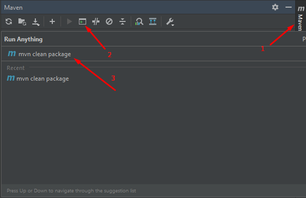
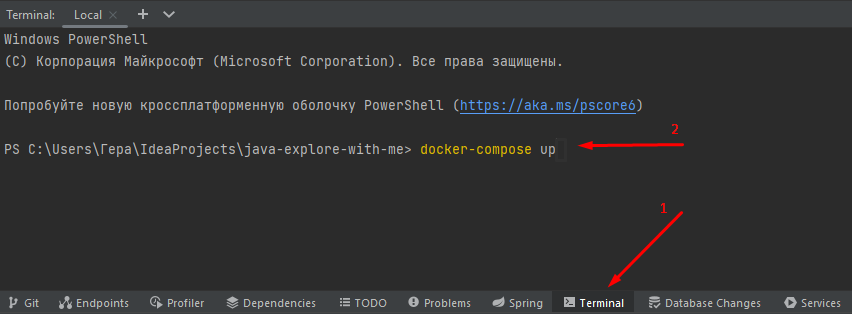

# ShareIt
Площадка позволяющая делиться своими вещами. Тут вы можете выставлять свои предметы, 
чтобы другие пользователи могли ими воспользоваться или Вы сами можете воспользоваться нужным Вам предметом.

# Пользователю:
1. Добавление - добавляй свои предметы и модерируй пользователей которые хотят им воспользоваться.
2. Пользование - Вы также можете заимствовать чужие предметы для пользования.
3. Просмотр - просматривайте список предметов которые вы одолжили/предоставили в пользование.
4. Комментарии - оставляйте комментарии к предметам, которыми уже пользовались
5. Поиск - удобрый поиск для нахождения нужного Вам предмета

# Инструкция по развёртыванию:
- Java 11+
- Docker
- Перед запуском, программу нужно подготовить: упакуйте проект используя команду "mvn clean package" как это показано на изображении

- Запустите Docker и зайдите в терминал среды разработки, введите команду "docker-compose up"

- Наслаждаетесь пользованием

# В грядущем обновлении планируется:
- Добавление пользователя в черный список
- Оценка (лайк/дизлайк)
